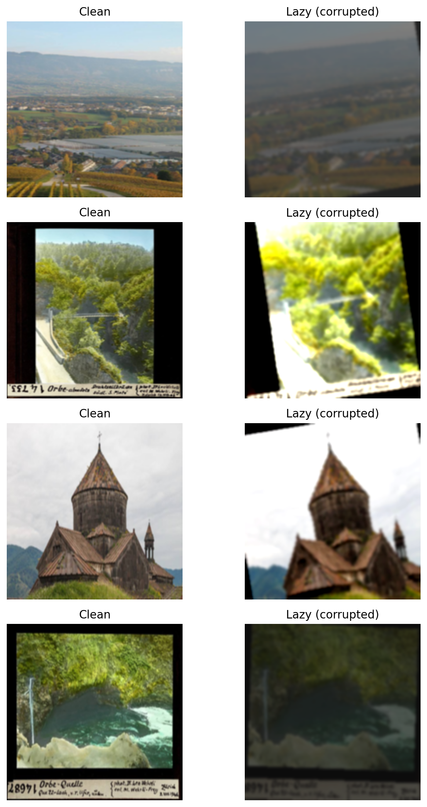
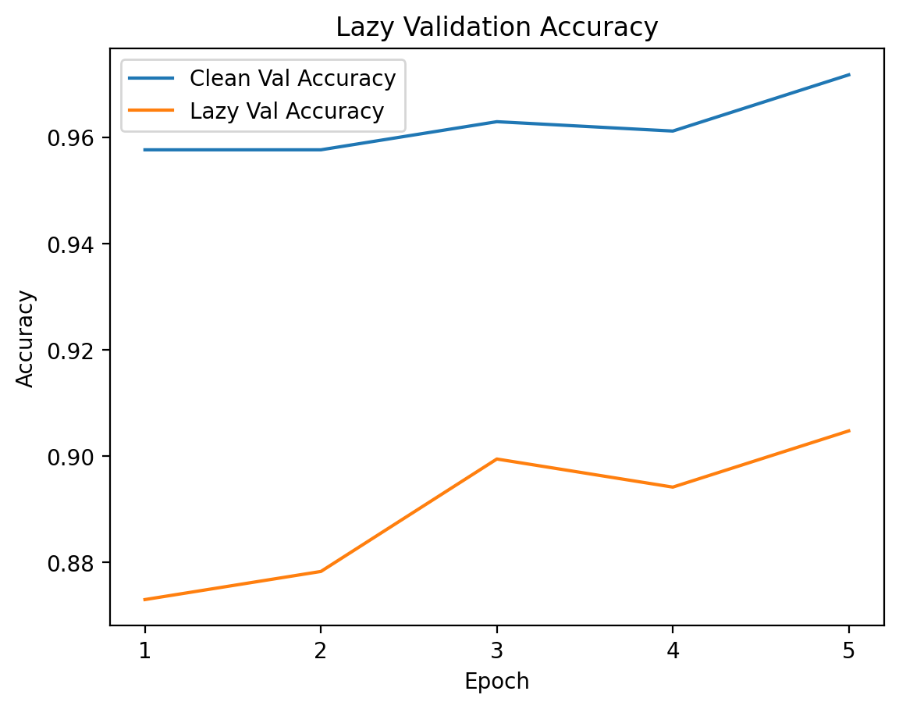

# Robust Landmark Recognition under Image Corruptions

Train a landmark classifier that stays accurate on clean images and degrades less when images are blurred, cropped, or color-shifted.

## Motivation

Image classifiers often look strong on clean benchmarks but fail under real-world noise (blur, mis-framing, lighting changes). This project measures that gap and tests whether targeted augmentations can improve robustness without sacrificing clean accuracy.

## Dataset

- Source: Hugging Face `pemujo/GLDv2_Top_51_Categories` (GLDv2 subset)
- Filtered to 10 iconic landmarks for a focused experiment:
  - Niagara Falls
  - Golden Gate Bridge
  - Eiffel Tower
  - Grand Canyon
  - Lake Como
  - Masada
  - Edinburgh Castle
  - Victoria Memorial, Kolkata
  - Faisal Mosque
  - Jurassic Coast
- Split: train/val from train split (90/10), official test split for evaluation

## Training Pipeline

Stages:

1. `clean_head`
   - Freeze backbone, train only classifier head.
2. `clean_finetune`
   - Unfreeze layer4 + head, fine-tune on clean data.
3. `robust`
   - Start from `clean_finetune`, train with lazy corruptions.

## Augmentations

- Clean:
  - Resize
  - Normalize (ImageNet)
- Lazy / Robust:
  - RandomRotation
  - RandomResizedCrop
  - GaussianBlur
  - ColorJitter

These simulate realistic user errors like mis-framing, motion blur, and lighting shifts.

## Evaluation Protocol

- Evaluate on clean test images and lazy-corrupted test images.
- Lazy evaluation is repeated 5x (stochastic corruption) and reported as the mean accuracy.

## Results (test set)

| Training Stage | Clean Accuracy | Lazy Accuracy |
| --- | --- | --- |
| clean_head | 92.4% | 69.7% |
| clean_finetune | 95.9% | 74.1% |
| robust | 96.9% | **90.7%** |

Robust training reduces the absolute accuracy drop under corruption from ~21.8% to ~6.2%.

## Visualizations

**1) Clean vs Lazy Examples**



Example clean test images (left) and corresponding "lazy" corruptions (right) used during robustness evaluation.

**2) Clean vs Lazy Validation Accuracy (Robust Training)**



Validation accuracy on clean vs corrupted images during robust training. Robust fine-tuning significantly improves performance under corruption while preserving clean accuracy.


## Key Takeaways

- Clean accuracy alone is a poor indicator for real-world performance.
- Targeted augmentations can recover >10% absolute accuracy under corruption.
- Robust fine-tuning preserves clean accuracy while reducing sensitivity to noise.

## Project Structure

```
.
├── train.py
├── model.py
├── transforms.py
├── data.py
├── engine.py
├── configs.py
├── results/
└── README.md
```

## How to Run

Install dependencies:

```bash
pip install -r requirements.txt
```

Train / evaluate:

```bash
python train.py
```

Notes:
- Select `STAGE` and `RUN_TRAIN` in `train.py`.
- `clean_finetune` expects `models/clean_head.pth`.
- `robust` expects `models/clean_finetune.pth`.

## References

- Dataset: GLDv2 subset on Hugging Face (`pemujo/GLDv2_Top_51_Categories`)
- Model: ResNet-18 (torchvision)
